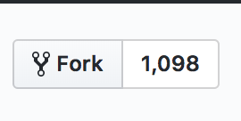
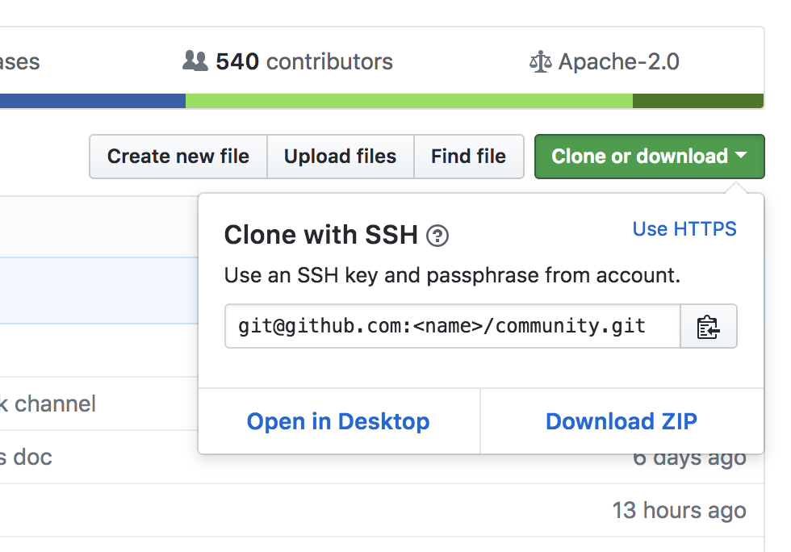
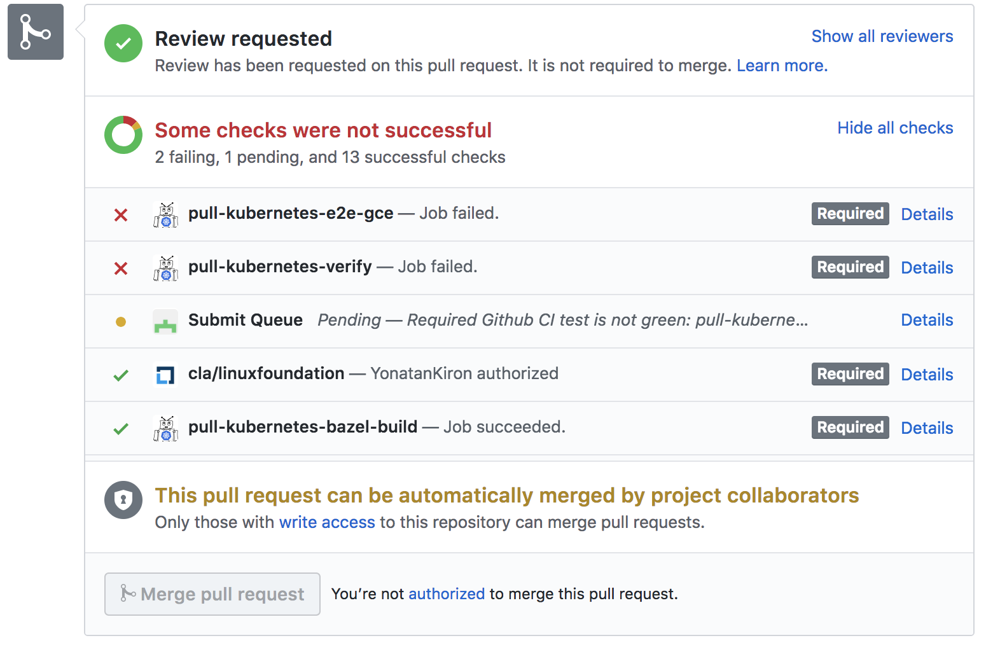

# Contributor Summit

## New Contributor Summit - Welcome!

Kubernetes is an open project. This summit will help you start contributing.

Contributing used to be joining a small boat and having to take responsibility right away. Now it's a much bigger boat for which there is orientation.

### Who is this for
- advanced users and looking at contributing
- you've contributed one patch/issue but want to know more
- you've just gotten a job that involves heaver Kubernetes work
- some bug is driving you crazy and you want to fix it

#### Goal
Go from a non-member contributor to members, reviewers, approvers, and owners.

Kubernetes now needs more senior reviewers now and to get there we need these sort of trainings.

### CLA signing
Sign it [here](https://github.com/kubernetes/community/blob/master/CLA.md) if you haven't already.

### Where to contribute - choose your own adventure!
- Contributor origin stories
  - people coming from linux backgrounds
  - people that want to improve the community
  - people that just started using Kubernetes and need a feature or a bug fix
  - people that want to learn about Kubernetes

- You can contribute to:
  - the docs
    - if it was not clear to you, it won't be clear to others. Newcomers have a unique perspective, so we love for people to help in this way.
    - look at these **S**pecial **I**nterest **G**roups (**SIGs**):
      - SIG-docs
      - SIG-contributor experience
  - Testing
    - lots of GO
    - SIGs:
      - SIG-testing
  - Code
    - submit PRs for Issues
    - sub-repositories and related projects
      - (definitely still part of the community!)
    - SIGs:
      - many, it depends on your area of interest

- Finding Your First Topic
  - you notice a Bug
  - you would like a feature
  - you're trying to learn a technology
  - your work involves developing community contributions
  - you want better docs
  - example: documenting becoming a contributor

### Group Exercise: Find Your Topic Exercise
- Explain on what part of Kubernetes you might want to contribute
- Tell people about your background, job, or interests that motivate you

### Communication in the Kubernetes Community
- there's a place for everybody in this community
- Standards of Communication
  - there's a huge effort around community
  - [CNCF Code of conduct](https://github.com/kubernetes/community/blob/master/code-of-conduct.md)
    - basic core conduct: be nice and respectful
- Unspoken rules/traditions:
  1. technical questions go on stackoverflow and slack, not GitHub
  2. GitHub issues and PRs often entail discussion related to the topic at hand. Stay courteous and follow up. Don't let PRs sit there that need rebasing (for example).
  3. Stay patient as people may address your questions and contributions from all over the world.

#### Slack:

[Join the slack here](Join Kubernetes on Slack!)
- There's a ton of channels!
- Join these for a start:
  - #kubernetes-users:
    - this is where people get help
  - #kubernetes-novice:
    - where people are learning
  - #sig-contribex:
    - contributor experience and help for finding where to look for help

#### Other Avenues of Communication
- Community Meetings
  - [Schedule](https://kubernetes.io/community/)
  - You may not understand a lot right away. Be patient with yourself.
  - You can join SIG meetings. You can find Mentors this way.
- Mailing lists
- @pinging someone on GitHub
  - don't be afraid of doing this
  - also don't be upset if people don't reply. some are overwhelmed by GitHub notifications
- Meetups
  - If there are no meetups in your area you can start one. Contact people in the #sig-contribex channel on slack for how to get started!
- Office Hours
  - for help getting started
- Twitter: [@kubernetesio](https://twitter.com/kubernetesio)
- Google Groups to join:
  - [kubernetes-dev@googlegroups](https://groups.google.com/forum/#!forum/kubernetes-dev) - for developing on the core repo
  - [kubernetes-users@googlegroups](https://groups.google.com/forum/#!forum/kubernetes-users) - where a lot of questions get answered

### The SIG system
- How work is organized
- **S**pecial **I**nterest **G**roups (**SIGs**)
- [Full list of all SIGs](https://github.com/kubernetes/community/blob/master/sig-list.md)
  - includes info on slacks, mailing lists, contacts, etc.
  - every SIG also has a README which contains the sig lead etc.
- SIGs change because tech changes. So the list changes every now and then

- Semi-autonomous teams
  - own leaders & charter
  - responsible for some code
  - some have own repos
  - slack channel and mailing lists
    - this may change soon (mailing lists)
  - meetings over Zoom generally
  - Subprojects (& Work Groups)

#### Types of SIGs

Unofficial list of the different types:
1. Feature Areas
  - `sig-auth`, `sig-apps`, `sig-autoscaling`, `sig-big-data`, `sig-cli`, `sig-multicluster`, `sig-network`, `sig-node`, `sig-scalability`, `sig-scheduling`, `sig-service-catalog`, `sig-storage`, `sig-ui`
2. Plumbing
  - in charge of upgrading and downgrading
  - `sig-cluster-lifecycle`, `sig-api-machinery`, `sig-orchestration(?)`
3. Cloud Providers
  - `sig-aws`, `sig-azure`, `sig-gcp`, `sig-ibmcloud`, `sig-openstack`
4. Meta
  - devoted to aspects of running the project
  - helps with getting an idea of how the whole project runs
  - `sig-architecture`, `sig-contributor-experience`, `sig-product-management`, `sig-release`, `sig-testing`
5. Docs
  - `sig-docs`
  - probably the single biggest SIG
  - in charge of docs and the website
  - you need to supply docs for features so you'll probably be a part of this

#### Working Groups (WGs) and Subprojects
- Working Groups was the old way. K8s is moving to subprojects. This is to improve clarity
- Examples:
  - areas, tools
  - Machine Learning is under sig-big-data
- Working groups often change

#### Picking the right SIG
1. Figure out what specific projects/areas you want to work on
2. Find out which SIG/WG/subproject covers that
  - a. Ask on #sig-contribex if you're unsure
  - b. Go to the SIG intros at a KubeCon
3. Join that SIG/subproject
  - a. If joining a WG/subproject also join the respective SIG

### Repos being refactored
- it's a bit messy right now
- this is being changed

### Repository

#### Core Repository
- [`kubernetes/kubernetes`](https://github.com/kubernetes/kubernetes) a.k.a `k/k`
- projects:
  - [k/Community](https://github.com/kubernetes/community)
    - has information on how the project runs
  - k/Features
    - File issue against this repo if you're planning a new feature
    - this is for tracking
  - k/Steering
  - k/Test-Infra
    - tests for bugs etc.
  - k/Perf-Tests
    - tests for performance are separate

### Docs/ Website
  - k/website
  - k/kubernetes-docs-cn
  - k/kubernetes-docs-ko

#### Developer tools
  - k/sample-controller*
  - k/sample-apiserver*
  - k/code-generator*
  - k/k8s.io
    - dev info like current issues
  - k/kubernetes-template project

#### Staging Repos
  - mirror repos of bits of the code
  - e.g.:
    - api
    - apiextensions-apiserver
    - apimachinery
    - apiserver
    - client-go
    - code-generator
    - kube-aggregator
    - metrics
    - sample-apiserver

#### SIG repos
  - release
  - federation
  - autoscaler
  - only 3 have their own repos along with some cloud providers
      - we'll get to that

#### Products & Tools
  - kubeadm, kubectl, kops, helm, charts, kompose, ingress-nginx, minikube, dashboard, heapster, kubernetes-anywhere, kube-openapi

#### Kube-Incubator
- most are not currently developed on or maintained

#### A historical accumulation
- the location does not indicate maintenance status
  - there's random stuff in kubernetes, kube-incubator and kubernetes-contrib
  - eventually this will be organized
  - ask someone in the SIG or look at the recent commits to figure out whether something is still maintained
- how it will be:
  - all accessory projects start in the kubernetes-sigs namespace
  - SIGs determine when/how they continue
  - this way we know who is responsible for projects

#### My repo, my rules
  - repos can have different:
    - ownership
    - approval workflows
    - merge workflows
    - release cycles
- Membership/Ownership

#### OWNERS files govern who approves code
- they're recursive to parent directories
- but some repos still use GitHub groups or other things

### Contributing by **Issues**
- writing a concise summary of the bug/problem can be harder than implementing the fix, so it's very important!
- Bug reports
  1. find the right repo for the bug
  2. create a complete & detailed bug reports
    - include labels
  3. Follow up with commentors/fixers

- Example of a good issue: [#63235](https://github.com/kubernetes/kubernetes/issues/63235)

```
Is this a BUG REPORT or FEATURE REQUEST?:
/kind bug

Uncomment only one, leave it on its own line:

/kind bug
/kind feature

What happened:
When use an existing azure disk(also called static provisioning) in pod, if that disk has partitions, the disk will be formatted in the pod mounting.

What you expected to happen:

How to reproduce it (as minimally and precisely as possible):

create a disk with source from an os disk, e.g.
az disk create --name duposdisk --resource-group andy-mg110 --sku Standard_LRS  --size-gb 30 --location westus2 --source  https://xxx.blob.core.windows.net/osdisk/k8s-agentpool-33591117-0-osdisk.vhd
use disk static provioning for that copied disk
kubectl exec -it nginx-azuredisk -- bash
that disk is already formatted before pod could access it
(...)
```

#### From Issue to Code/Docs
1. Start with an issue that proposes a change
2. Apply all the appropriate labels
3. cc SIG leads and concerned devs (if you know about them)
  - by adding their handle
4. Raise the issue at a SIG meeting or on teh list
  - to ensure people know the issue is there because there are A LOT of issues
5. When you have "lazy consensus", submit a PR
  - if a couple of people approve it and no one raises concerns

#### Required Labels
- this is an elaborate system
- because the GitHub system is flat we use slashes to create a taxonomy
- [List of canonical Labels](https://github.com/kubernetes/test-infra/blob/master/label_sync/labels.md)
- these get added by you using a bot
  - the bot will remind you if you forget
  - if you don't add them after a while the bot will close your issue

##### sig/ label
  - e.g. sig/auth, sig/node, sig/test-infrastructure, sig/api-machinery

##### kind/ label
- defines kind of issue
- e.g.:
  - kind/bug
  - kind/feature
  - kind/documentation
  - kind/design
  - kind/flake
  - kind/cleanup
  - kind/failing-test

##### triage/ label
  - these labels will close an issue as it has been triages
  - e.g.:
    - `triage/duplicate`
    - `triage/needs-information`
    - `triage/support`
    - `triage/unreproduceable`
    - `triage/unresolved`

##### priority/ label
- how critical is this issue?
- e.g.:
  - `priority/critical-urgent`
  - `priority/important-soon`
  - `priority/important-longterm`
  - `priority/backlog`
  - `priority/awaiting-evidence`

##### area/ label - optional
- may  define specific focus within the sig
- no standardization
- e.g.
  - area/kubectl
  - area/api

##### help-wanted
- currently mostly complicated things
- do not assume these are easy to start with
- adding "good first issue" soon

##### Following up
- make sure you check issue for comments and respond

### Making Contributions by PR - A hands-on walk-through
1. Go to [https://github.com/kubernetes/community](https://github.com/kubernetes/community)
2. Go to [contributors](https://github.com/kubernetes/community/tree/master/contributors)
3. there's a folder [new-contributor-playground](https://github.com/kubernetes/community/tree/master/contributors/new-contributor-playground)
  - this is just for you
  - there are some rules:
    - stick to this folder
    - be responsible about this area of the repository

#### Let's open a PR
**DO NOT DO THIS UNLESS AT A WORKSHOP - Use this only as a guide**

1. Set up repo
  1. Fork this repo:
    
  2. Clone this repo:
  
  3. In your terminal run `git clone git@github.com:<NAME>/community.git`
  3. run `cd community`
  4. Check remotes by running `git remote`
  5. set upstream to `git@github.com:kubernetes/community.git` by running `git remote add upstream git@github.com:kubernetes/community.git`
    - you can name it something other than remote
2. Branch
  1. `git checkout -b kubecon`
3. Add a commit
  1. Now look at the repo in your favorite
  2. navigate to the `contributors/new-contributor-playground/` folder
  3. Add a new file in this folder.
  4. `git commit`
    - Add a short headline AND a paragraph describing your intent and the background for this PR.
    - `:wq` to exit vim
  5. Run `git log` to see your commit
4. Push local branch to your fork of the repo
  6. Run `git push -u origin kubecon` to push your local branch to your fork of the repository
    - Do NOT push to the `kubernetes/community` repo
5. Within the GitHub UI create the PR
    - Read the templated text
    - Get rid of the templated text afterwards
    - -> the Robot will do a lot of things now
      - it adds a `size` label
      - it adds reviewers based on the OWNERS file
        - Approvers are one level above reviewers
        - you will need an approval from an approver before you can merge
      - it adds the label `area/new-contributor-track` based on the OWNERS file
      - it adds `cncf-cla:yes` if you have signed the CLA
      - it adds `needs-ok-to-test` if you are not a member
        - you can become a member after a couple of PRs
        - you will need two sponsors, you can ask someone who reviewed your PR
        - a member will need to say `/ok-to-test` to remove this label
6. The bot's message says `assign additional people` - don't get scared if you don't know whom, check the owners file.
  - comment `/assign @<person>` to assign
7. There may be comments from your reviewer:
  - is there an issue related?
    - with big fixes/features you need to always file an issue first.
    - only very small things can happen without issues
  - Address the comments and add new commit (`git commit`) with commit message as before and run `git push`
    - force push if you rebased
8. Get the necessary approvals from an approver (these are listed in the OWNERS file) typing `/lgtm`
  - this can take a while
  - ping them again if they don't reply for a while, people can be busy or miss notifications
9. The bot will merge your PR

##### Notes
- Squashing commits
  - Everything that content-wise belongs into one commit should be separate as its own commit
- Difference between LGTM and approve
  - LGTM means it is technically ok
  - Approval means the code is good to join the repo (could be that the feature is good to be added ork not)

### Test Infrastructure
- At the bottom of PRs there are test (example: [#63151](https://github.com/kubernetes/kubernetes/pull/63151))

  - required tests need to pass before the PR can merge
  - In this case two tests are failing
    - don't panic if this happens
    - click on the details link
      - k8s-gubernator gives you more information on what test failed and allows you to see the artifacts for the tests
  - [Testgrid](https://k8s-testgrid.appspot.com/presubmits-kubernetes-blocking#pull-kubernetes-e2e-gce&include-filter-by-regex=%5EOverall%24%7CTest) allows you to see tests running across different PRs
     - this can help you identify flaky tests or whome to ask for help
  - `/retest` allows you to have the tests run again
  - [`https://prow.k8s.io/command-help`](https://prow.k8s.io/command-help) has an overview of all commands like `/meow`

### Kubernetes Documentation - Anyone can contribute to docs.
^ Literally anyone!

- Contributing to docs is a great path to org membership (you generally need at least 5 substantial PRs).

- Docs:
  - Website's code is on [`kubernetes/website`](https://github.com/kubernetes/website)

#### Working with docs
- docs use the Kubernetes bot (as described above)
- different from other repos: you have to branch from master to update current docs
  - because docs do not always immediately go live
- to create docs for a specific release branch from release-1.X
  - any changes made to master will immediately go live

#### **Anyone** can contribute to docs
- the docs people are happy to help you with the process!

### Testing and building your changes
- Key initial repos:
  - [kubernetes/kubernetes](https://github.com/kubernetes/kubernetes)
  - [kubernetes/community](https://github.com/kubernetes/community)

- Dev environment:
  - probably easiest on linux
  - but generally:
    - have lots of RAM and CPU
    - have multiple 10s of GBs of disk
    - use linux
    - place your k8s git repo fork in: $GOPATH/src/k8s.io/kubernetes
      - kubernetes expects to be in your Go path
      - you will get odd build failures if you don't have it there
    - think about what your test cluster will be

- Building
  - More info on this [here]([https://github.com/kubernetes/kubernetes/blob/master/build/README.md](https://github.com/kubernetes/kubernetes/blob/master/build/README.md)
  - Golang!
  - you need to have docker installed and up and running
  - Run `cd kubernetes` and `./build/run.sh make`
    - because of go you need to actually run this somewhere else so run `cd go/src/k8s.io/kubernetes` and again `./build/run.sh make`
  - build will take a long time
  - Note: builds are incremental, if your build fails due to resource failures, it will pick up where it failed
    - you will likely have to keep running it as it will fail a lot but eventually get to passing
  - Run `make WHAT=`cmd/kubectl` to build that subproject

- Running the build
  - `ls -al ./_output/local/bin/linux/amd64` (only works for linux)

- Testing:
  - Unit tests can be run locally
    - the k8s way:
      - Run `cd ~/go/src/k8s.io/kubernetes`
      - Run `make test WHAT=./cmd/kubeadm/app/util`
    - or:
      - Run `cd ~/go/src/k8s.io/kubernetes/cmd/kubeadm/app/util/`
      - Run `test ./..`
  - Integration and End-to-end can't
